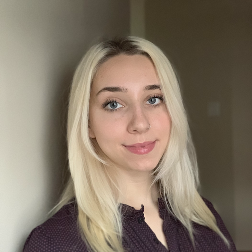

--- 
title: "Analysis Using R"
subtitle: "Canadian Bioinformatics Workshop"
author: "Instructors: Shraddha Pai, Delaram Pouyabahar"
date: "last modified `r Sys.Date()`"
site: bookdown::bookdown_site
output: bookdown::gitbook
documentclass: book
bibliography: [book.bib]
biblio-style: nature
csl: nature.csl
link-citations: yes
github-repo: rstudio/bookdown-demo
favicon: images/favicon.ico
description: "Principles of exploratory data analysis, RNAseq differential expression, and generalized linear models"
---

# Welcome {-}
Welcome to Analysis Using R 2025.

## Schedule {-}
| Time (EDT) |                                        Day 1                                       | Time (EDT) |                               Day 2                              |
|:--------------:|:-----------------------------------------------------------------------------------:|:--------------:|:-----------------------------------------------------------------:|
|      8:30      |                                 Arrivals & Check-in                                 |      8:30      |                              Arrivals                             |
|      9:00      |                                 Welcome (Nia Hughes)                                |      9:00      |   Day 1 review Linear mixed models and evaluation (Shraddha Pai)  |
|      9:30      |         Exploratory data analysis and introducing clustering (Shraddha Pai)         |      10:00     |                           Break (30min)                           |
|      10:30     |                                    Break (30min)                                    |      10:30     |       Short linear model exercise (Shraddha Pai)      |
|      11:00     |     Exploratory data analysis and clustering project (Shraddha Pai)     |      12:30     |                      Class photo + Lunch (1h)                     |
|      13:00     |                                      Lunch (1h)                                     |      13:30     |      Bioconductor for differential expression (Shraddha Pai)      |
|      14:00     |                      Dimensionality reduction (Delaram Pouyabahar)                     |      14:30     |                           Break (30min)                           |
|      15:00     |                                    Break (30min)                                    |      15:00     | Short differential expression exercise (Shraddha Pai) |
|      15:30     | Short dimensionality reduction and clustering project (Delaram Pouyabahar) |      17:00     |                      Survey & Closing Remarks                     |
|      17:30     |                                       Finished                                      |      17:30     |                              Finished                             |

## Meet your Faculty {-}

### Shraddha Pai {.unlisted .unnumbered}
Investigator I, OICR<br>
Assistant Professor, University of Toronto


Dr. Pai integrates bulk tissue and single-cell genomics and computational methods to advance precision medicine. The <a href="https://www.shraddhapailab.com/">Pai Lab at the Ontario Institute for Cancer Research</a> focuses on biomarker discovery for detection, diagnosis and prognosis in brain cancers and other brain-related disorders.

### Delaram Pouyabahar {.unlisted .unnumbered}
Title TBA <br>
Institute TBA<br>

### Zoe Klein {.unlisted .unnumbered}

PhD. Candidate<br>
University of Toronto

Zoe is a PhD level candidate in the Department of Molecular Genetics at the University of Toronto. Her thesis work in the Reimand lab involves using computational tools to investigate the role of non-coding RNA in cancer. 
&nbsp;&nbsp;<br>
&nbsp;&nbsp;<br>

### Nia Hughes {.unlisted .unnumbered}


Program Manager<br>
Bioinformatics.ca<br>
<a href="mailto:nia.hughes@oicr.on.ca">nia.hughes@oicr.on.ca</a>


Nia is the Program Manager for Bioinformatics.ca, where she coordinates the Canadian Bioinformatics Workshop Series. Prior to starting at the OICR, she completed her M.Sc in Bioinformatics from the University of Guelph in 2020 before working there as a bioinformatician studying epigenetic and transcriptomic patterns across maize varieties.

<p></p>

## Pre-workshop Materials and Laptop Setup Instructions {-}

### Laptop Setup Instructions {-}

A checklist to setup your laptop can be found here. 

Install these tools on your laptop before coming to the workshop:

1. R (4.0+)
<i>Note:</i> MacBook users with an Apple silicon chip (e.g., M1 or M2) should install the "arm64" version of R, while MacBook users with an Intel chip should install the regular (64-bit) version of R. You can check your laptop's hardware specifications by clicking the Apple icon (top left corner) > About This Mac and verifying whether the chip is Apple or Intel.
2. Rstudio
3.  Make sure you have a robust internet browser such as Firefox, Safari or Chrome (not Internet Explorer).
4.  Make sure you have a PDF viewer (e.g. Adobe Acrobat, Preview or similar) or that you can read PDF files in your Web browser.

### R packages {-}

```{r install-packages, eval=TRUE}
pkgList <- c("tidyverse", "clValid","rgl","RColorBrewer","corrplot","ClusterR",
  "Rtsne","umap","BiocManager","mlbench","plotrix", "factoextra")
for (cur in pkgList){
  message(sprintf("\tChecking for %s ...", cur))
  if (!requireNamespace(cur, quietly = TRUE)) install.packages(cur)
}

biocPkg <- c("edgeR","bladderbatch","airway")
for (cur in biocPkg){
  if (!requireNamespace(cur, quietly = TRUE)) BiocManager::install(cur)
}
```

### Download example data {-}

1. Download data for the workshop: [AUR2025_data.zip](https://drive.google.com/file/d/1DUSqDM1DGQaqPOk1iL8JxfU0TgCr-4MR/view?usp=sharing).
2. Move the zip file to your working directory (usually under "/Users/yourname"). 
3. Unzip the file. You should see a folder with 4 files in it.

# Lectures {-}

* Module 1: Exploratory Data Analysis and Clustering
<iframe src="https://docs.google.com/presentation/d/1j8HL_KECMj8kkjoETVF5geTiNuxPyNTT/preview" width="640" height="480" allow="autoplay"></iframe>  

* Module 2: Dimensionality reduction for visualization and analysis
<iframe src="https://docs.google.com/presentation/d/1Q5-takWa8ZjpTjzBNZ8i78OYkXjN028E/preview" width="640" height="480" allow="autoplay"></iframe>  

* Module 3: Generalized linear models
<iframe src="https://docs.google.com/presentation/d/1cdmhQ6Qm5d-S1sTbih5a0ZHHzuTTwOSA/preview" width="640" height="480" allow="autoplay"></iframe>  

* Module 4: Multiple hypothesis testing with RNA-seq differential expression analysis
<iframe src="https://docs.google.com/presentation/d/1NKcPfEib_GlGqh8T37BkdeGoEHnCq9E4/preview" width="640" height="480" allow="autoplay"></iframe>  
